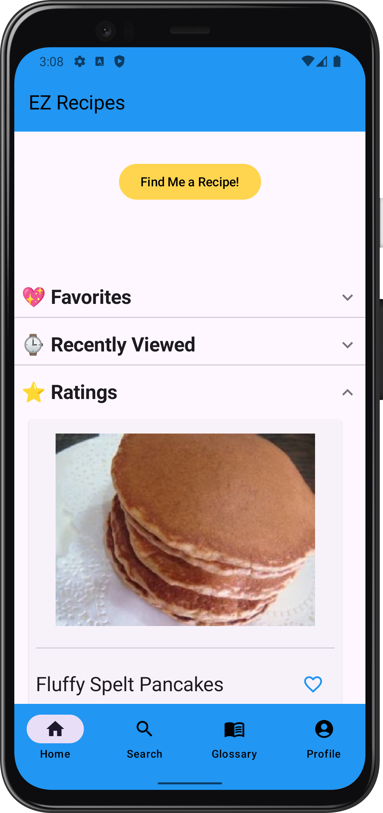
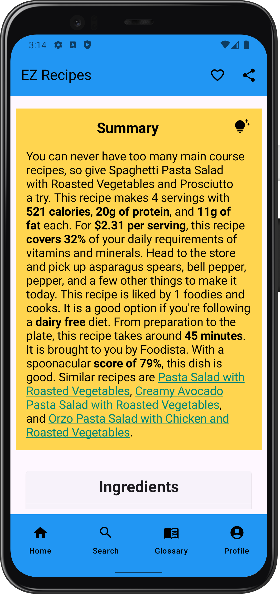
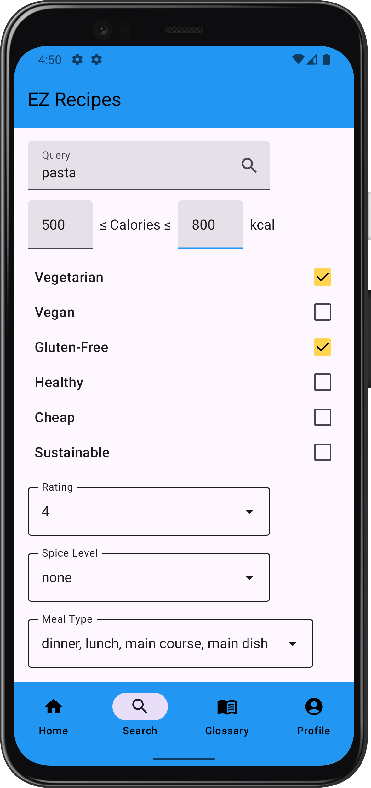
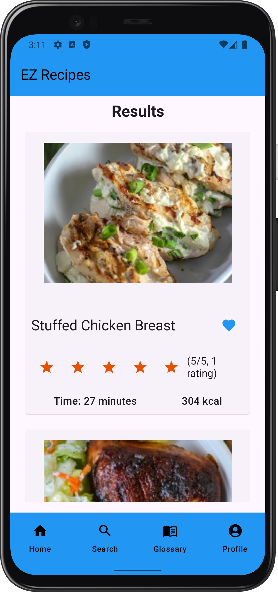

# EZ Recipes Android App

[](https://github.com/Abhiek187/ez-recipes-android/actions/workflows/fastlane.yml)
[](https://github.com/Abhiek187/ez-recipes-android/actions/workflows/codeql.yml)

<a target="_blank" rel="noopener noreferrer" href='https://play.google.com/store/apps/details?id=com.abhiek.ezrecipes&pcampaignid=pcampaignidMKT-Other-global-all-co-prtnr-py-PartBadge-Mar2515-1'>
    
</a>

<div>
    
    
    
    
    
    
    
    
</div>

## Overview

Cooking food at home is an essential skill for anyone looking to save money and eat healthily. However, learning how to cook can be daunting, since there are so many recipes to choose from. Even when meal prepping, knowing what ingredients to buy, what equipment is required, and the order of steps to make the meal can be hard to remember for many different recipes. Plus, during busy days, it's nice to be able to cook up something quick and tasty.

Introducing EZ Recipes, an app that lets chefs find low-effort recipes that can be made in under an hour, use common kitchen ingredients, and can produce multiple servings. On one page, chefs can view what the recipe looks like, its nutritional qualities, the total cooking time, all the ingredients needed, and step-by-step instructions showing what ingredients and equipment are required per step. Each recipe can be shared so other chefs can learn how to make the same recipes.

Chefs can either find a random recipe or search for one using various filters, including by name, dietary restrictions, spice level, and meal type.

The app features a glossary to easily look up the meaning of common terms found in recipes. This will better assist newer chefs in learning how to cook, prep certain ingredients, and use certain kitchen tools. Think [How to Stock](https://github.com/Abhiek187/how-to-stock), but for cooking food instead of managing finances.

## Features

- Android app created using Jetpack Compose and MVVM architecture
- Material Design UI
- Responsive and accessible mobile design
- REST APIs to a custom [server](https://github.com/Abhiek187/ez-recipes-server) using Retrofit, which fetches recipe information from [spoonacular](https://spoonacular.com/food-api) and MongoDB
- Offline data storage using DataStore and Room
- App Links to open recipes from the web app to the mobile app
- Automated testing and deployment using CI/CD pipelines in GitHub Actions and Fastlane
- Mermaid to write diagrams as code

## Pipeline Diagrams

### Unit Tests


### Instrumented Tests


### CodeQL


### Deployment


## Installing Locally

Android Studio and Java are required to run Android apps locally.

1. [Clone](https://github.com/Abhiek187/ez-recipes-android.git) this repo.
2. Open `EZRecipes` in Android Studio.
3. Build the project using Gradle.
4. Run the **app** configuration.

The recipes will be fetched from the EZ Recipes server hosted on https://ez-recipes-server.onrender.com. To connect to the server locally, follow the directions in the [EZ Recipes server repo](https://github.com/Abhiek187/ez-recipes-server#installing-locally) and change `SERVER_BASE_URL` under `Constants.kt` to `http://10.0.2.2:5000`. (`10.0.2.2` points to `localhost` on the development machine. Since the Android emulator is a virtual machine, `127.0.0.1` points to `localhost` on the emulator instead of the development machine.)

To allow `http://` connections, add `android:usesCleartextTraffic="true"` to the `<application>` tag in `AndroidManifest.xml`. Make sure not to keep this enabled since it will make the Android app insecure.

### Testing

Unit and instrumented tests can be run directly from Android Studio or through the command line using Fastlane. Follow the [docs](https://docs.fastlane.tools/getting-started/android/setup/) to setup Fastlane on Android. In addition, run the following to install all dependencies locally:

```bash
cd EZRecipes
chmod u+x gradlew
bundle config set --local path 'vendor/bundle'
bundle install
```

For unit tests, run the following command:

```bash
bundle exec fastlane android test
```

For instrumented tests, run the following command, where API_LEVEL is the Android API version to install on the emulator:

```bash
bundle exec fastlane android ui_test api:API_LEVEL
```

This [table](https://source.android.com/docs/setup/about/build-numbers#platform-code-names-versions-api-levels-and-ndk-releases) shows which API level corresponds with each Android release.

### Screenshots

Screenshots can be generated automatically using Fastlane. In addition to the Fastlane installation steps above, ImageMagick is required to add the device frames:

```bash
brew install libpng jpeg imagemagick # if on Mac
sudo apt install imagemagick # if on Linux
```

Then run the following command to generate screenshots at `ez-recipes-android/EZRecipes/fastlane/screenshots` (ignored by git):

```bash
bundle exec fastlane android screenshots
```

Make sure a device is running by checking `adb devices`.

### Deployment

Follow the steps on [Fastlane's docs](https://docs.fastlane.tools/getting-started/android/setup/#setting-up-supply) to generate a private key to connect to the Google Play Developer API. Validate the connection by running:

```bash
bundle exec fastlane run validate_play_store_json_key json_key:JSON_KEY_PATH
```

Then follow these steps to create a new release for select testers in the internal track:

1. Make sure the `fastlane/metadata` directory is up-to-date by running `bundle exec fastlane android sync_metadata`
2. Write the release notes for the next version code in `fastlane/metadata/android/en-US/changelogs`, where the filename is `VERSION_CODE.txt`. `VERSION_CODE` is the latest version code + 1.
3. Run `bundle exec fastlane android internal` and select whether this is a major, minor, or patch update. The version name and code will be adjusted in the app's `build.gradle` file accordingly.

Once the internal build is tested and ready for production, run `bundle exec fastlane android deploy` to promote the internal release to the production track. Send the changes for approval on the Google Play Console and wait for Google to approve the app (usually a few days to a week on average).

## Future Updates

Check the [EZ Recipes web repo](https://github.com/Abhiek187/ez-recipes-web#future-updates) for a list of future updates.

## Related Repos

- [Web app](https://github.com/Abhiek187/ez-recipes-web)
- [iOS app](https://github.com/Abhiek187/ez-recipes-ios)
- [Server](https://github.com/Abhiek187/ez-recipes-server)

---
<sup>Google Play and the Google Play logo are trademarks of Google LLC.</sup>
